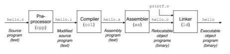
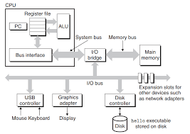

# Ch01. A Tour of Computer Systems

## 개론
**컴퓨터 시스템**은 하드웨어와 시스템 소프트웨어로 구성된다.
**응용 프로그램**은 하드웨어와 시스템 소프트웨어의 조화로운 작동에 의해 실행된다.
시스템에 대한 지식을 활용하면 강력한 프로그램을 구현할 수 있다.
시스템에 대한 공부는 **프로그램의 수명주기**에서 시작된다.

## 1.1 정보는 비트와 컨텍스트로 이뤄져 있다.
**프로그램의 생명주기**는 소스파일에서 시작된다.

**소스파일**은 0 또는 1로 표시되는 비트들의 연속이다. 소스 파일의 기본단위는 **바이트**로 8비트로 구성된다. 각각의 바이트는 텍스트 문자를 나타낸다.

**모든 시스템의 내부정보**는 비트들로 표시한다. 객체들은 비트가 속한 콘텍스트를 통해 구분한다. 즉, 동일한 비트라도 **콘텍스트**에 따라 의미가 달라질 수 있다.

## 1.2 프로그램은 다른 프로그램에 의해 번역된다.
우리가 작성한 소스파일은 인간이 읽기에 적합하다. 하지만 컴퓨터는 비트만을 이해하기 때문에 소스파일을 실행가능한 파일로 번역을 해야한다.

소스파일(텍스트파일)을 실행 가능 파일로 번역하기 위한 시스템을 컴파일 시스템이라고 한다.


컴파일 과정은 다음의 4단계이다.
- 전처리 단계(pre-processing)
- 컴파일 단계(compiling)
- 어셈블리 단계(Assembling)
- 링킹 단계(Linking)

설명의 편의를 위해 hello.c 프로그램을 예를 들어보자.
```C
#include <stdio.h>

int main()
{
    printf("Hello World\n");
    return 0;
}
```

### 전처리 단계
전처리기가 소스파일의 헤더를 읽고 필요한 소스코드를 찾아 텍스트 파일에 추가한다. hello.c 는 필요한 코드들이 추가 된 채 hello.i 로 번역된다.

### 컴파일 단계
컴파일러가 hello.i 에 어셈플리어 프로그램을 추가하면서 hello.i를 hello.s로 번역한다.

### 어셈블리 단계
어셈블러가 hello.s를 기계어로 번역한다. hello.s 를 hello.o로 번역한다.

### 링크 단계
hello.c 를 보면 소스코드 내에서 정의되지 않은 함수 printf가 존재한다. printf는 별도의 파일 printf.o에서 존재한다. 링커는 printf 처럼 외부에서 존재하는 함수 등의 프로그램들을 hello.o와 함께 통합해준다. 그 결과, 실행 가능한 파일이 생성된다.

## 1.3 컴파일시스템의 동작을 이해해야하는 이유
- 프로그램 성능 최적화
- 링크 에러 이해
- 보안 약점 회피

## 1.4 프로세서의 역할

### 시스템의 하드웨어 조직
프로그램 실행과 관련 된 사건들을 이해하기 위해서는 하드웨어 조직에 대한 이해가 필요하다. 통상적인 경우, 시스템은 다음의 요소를 가지고 있다.
- 버스
- 입출력 장치
- 메인 메모리
- 프로세서

### 버스(buses)
시스템의 신경계와 같은 요소로 시스템 간에 바이트 정보를 수송한다. 수송되는 정보의 기본단위는 워드(word)다. 통상적으로, 워드는 4바이트 혹은 8 바이트다.

### 입출력 장치
입출력 장치는 하드웨어 시스템과 외부를 연결해준다. 마우스, 키보드, 디스플레이, 디스크 드라이브 등이 입출력 장치에 해당한다. 

### 메인 메모리
프로세서가 프로그램을 실행하고 있을 때 데이터와 프로그램을 모두 저장하는 임시 장치다. 

### 프로세서
메인 메모리에 저장된 instruction들을 해독(실행)하는 엔진이다.
프로세서에는 프로그램 카운터(PC)가 있다.
PC는 메인 메모리의 기계어 인스트럭션들을 가리킨다.
프로세서가 인스트럭션을 실행할 때마다 PC는 다음 이스트럭션을 가리킨다. 

**CPU의 작업**  
CPU는 적재(load)와 저장(store)을 통해 워드를 새로운 값으로 만든다.  
CPU는 작업(operate)을 통해 레지스터에 있는 두개의 워드들을 ALU에 복사 후 수식 연산을 수행한 뒤에 레지스터로 그 결과를 보내서 저장한다.
- 적재(Load): 메인 메모리 -> 레지스터
- 저장(Store): 레지스터 -> 메인 메모리
- 작업(Operate): 레지스터 -> ALU -> 레지스터 
- 점프(jump): 인스트럭션으로부터 워드를 추출 후 PC에 복사한다.

### hello 프로그램의 실행
쉘이 실행된다고 가정하자.
- 사용자가 쉘의 프롬프트에 텍스트를 입력하면 이 데이터는 레지스터에서 읽힌 뒤에 메모리에 저장된다.
- 사용자가 엔터를 누르면 명령 입력이 마쳐졌다는 것을 시스템에 알리게 된다. 쉘은 디스크에서 메모리로 명령어가 의도한 프로그램을 로딩한다. 
- 프로세서는 프로그램을 실행한다.
