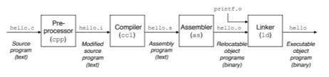
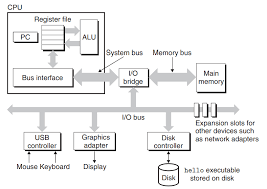

# Ch01. A Tour of Computer Systems

## 개론
**컴퓨터 시스템**은 하드웨어와 시스템 소프트웨어로 구성된다.
**응용 프로그램**은 하드웨어와 시스템 소프트웨어의 조화로운 작동에 의해 실행된다.
시스템에 대한 지식을 활용하면 강력한 프로그램을 구현할 수 있다.
시스템에 대한 공부는 **프로그램의 수명주기**에서 시작된다.

## 1.1 정보는 비트와 컨텍스트로 이뤄져 있다.
**프로그램의 생명주기**는 소스파일에서 시작된다.

**소스파일**은 0 또는 1로 표시되는 비트들의 연속이다. 소스 파일의 기본단위는 **바이트**로 8비트로 구성된다. 각각의 바이트는 텍스트 문자를 나타낸다.

**모든 시스템의 내부정보**는 비트들로 표시한다. 객체들은 비트가 속한 콘텍스트를 통해 구분한다. 즉, 동일한 비트라도 **콘텍스트**에 따라 의미가 달라질 수 있다.

## 1.2 프로그램은 다른 프로그램에 의해 번역된다.
우리가 작성한 소스파일은 인간이 읽기에 적합하다. 하지만 컴퓨터는 비트만을 이해하기 때문에 소스파일을 실행가능한 파일로 번역을 해야한다.

소스파일(텍스트파일)을 실행 가능 파일로 번역하기 위한 시스템을 컴파일 시스템이라고 한다.


컴파일 과정은 다음의 4단계이다.
- 전처리 단계(pre-processing)
- 컴파일 단계(compiling)
- 어셈블리 단계(Assembling)
- 링킹 단계(Linking)

설명의 편의를 위해 hello.c 프로그램을 예를 들어보자.
```C
#include <stdio.h>

int main()
{
    printf("Hello World\n");
    return 0;
}
```

### 전처리 단계
전처리기가 소스파일의 헤더를 읽고 필요한 소스코드를 찾아 텍스트 파일에 추가한다. hello.c 는 필요한 코드들이 추가 된 채 hello.i 로 번역된다.

### 컴파일 단계
컴파일러가 hello.i 에 어셈플리어 프로그램을 추가하면서 hello.i를 hello.s로 번역한다.

### 어셈블리 단계
어셈블러가 hello.s를 기계어로 번역한다. hello.s 를 hello.o로 번역한다.

### 링크 단계
hello.c 를 보면 소스코드 내에서 정의되지 않은 함수 printf가 존재한다. printf는 별도의 파일 printf.o에서 존재한다. 링커는 printf 처럼 외부에서 존재하는 함수 등의 프로그램들을 hello.o와 함께 통합해준다. 그 결과, 실행 가능한 파일이 생성된다.

## 1.3 컴파일시스템의 동작을 이해해야하는 이유
- 프로그램 성능 최적화
- 링크 에러 이해
- 보안 약점 회피

## 1.4 프로세서의 역할

### 시스템의 하드웨어 조직
프로그램 실행과 관련 된 사건들을 이해하기 위해서는 하드웨어 조직에 대한 이해가 필요하다. 통상적인 경우, 시스템은 다음의 요소를 가지고 있다.
- 버스
- 입출력 장치
- 메인 메모리
- 프로세서

### 버스(buses)
시스템의 신경계와 같은 요소로 시스템 간에 바이트 정보를 수송한다. 수송되는 정보의 기본단위는 워드(word)다. 통상적으로, 워드는 4바이트 혹은 8 바이트다.

### 입출력 장치
입출력 장치는 하드웨어 시스템과 외부를 연결해준다. 마우스, 키보드, 디스플레이, 디스크 드라이브 등이 입출력 장치에 해당한다. 

### 메인 메모리
프로세서가 프로그램을 실행하고 있을 때 데이터와 프로그램을 모두 저장하는 임시 장치다. 

### 프로세서
메인 메모리에 저장된 instruction들을 해독(실행)하는 엔진이다.
프로세서에는 프로그램 카운터(PC)가 있다.
PC는 메인 메모리의 기계어 인스트럭션들을 가리킨다.
프로세서가 인스트럭션을 실행할 때마다 PC는 다음 이스트럭션을 가리킨다. 

**CPU의 작업**  
CPU는 적재(load)와 저장(store)을 통해 워드를 새로운 값으로 만든다.  
CPU는 작업(operate)을 통해 레지스터에 있는 두개의 워드들을 ALU에 복사 후 수식 연산을 수행한 뒤에 레지스터로 그 결과를 보내서 저장한다.
- 적재(Load): 메인 메모리 -> 레지스터
- 저장(Store): 레지스터 -> 메인 메모리
- 작업(Operate): 레지스터 -> ALU -> 레지스터 
- 점프(jump): 인스트럭션으로부터 워드를 추출 후 PC에 복사한다.

### hello 프로그램의 실행
쉘이 실행된다고 가정하자.
- 사용자가 쉘의 프롬프트에 텍스트를 입력하면 이 데이터는 레지스터에서 읽힌 뒤에 메모리에 저장된다.
- 사용자가 엔터를 누르면 명령 입력이 마쳐졌다는 것을 시스템에 알리게 된다. 쉘은 디스크에서 메모리로 명령어가 의도한 프로그램을 로딩한다. 
- 프로세서는 프로그램을 실행한다.

## 1.5: 캐시메모리
### 프로그램 실행시 극복과제

프로그램의 실행과정을 할 때 컴퓨터 내부에서 컴포넌트들이 서로 데이터를 주고 받습니다. 데이터를 주고받는다는 것은 데이터를 한 장소에서 복사한 후에 다른 장소로 이동시켜서 저장시키는 것입니다. 데이터는 여러 장소를 이동해야하기 때문에 시간이 걸립니다. 이 시간을 줄이는 것이 시스템 설계자들의 목표입니다.

### 원인

현실에서는 큰 물체는 느리고 작은 물체는 빠릅니다. 컴퓨터의 세계도 마찬가지입니다. 하드디스크와 같이 덩치가 큰 녀석들로부터 데이터를 가져오는 것은 메모리에서 데이터를 가져오는 것보다 천만배의 시간이 필요합니다. 메모리부터 데이터를 가져오는 것보다 프로세서로부터 데이터를 가져오는 것도 제곱 단위의 시간이 필요합니다.
프로세서를 개발하는 것은 메모리를 개발하는 것보다 쉽습니다. 따라서 프로세서와 메모리의 격차가 갈수록 커져갔습니다. 이 격차를 메꾸기 위해 캐시 메모리가 도입되었습니다.

### 캐시메모리


캐시 메모리는 프로세서가 단기간에 필요로 할 가능성이 높은 정보를 임시로 저장할 목적으로 쓰이는 메모리입니다. 메인메모리보다 크기는 작지만 속도는 1000 배 정도 빠릅니다. 캐시메모리도 크기에 따라 종류가 있습니다. L1이 가장 빠르고 L2, L3 순으로 느려집니다. 하지만 메인메모리보다는 빠릅니다.

## 1.6: 메모리의 계층 구조
성능이 빠른 장치와 느린 장치 사이에 데이터 임시 저장소를 두면 시스템 전체의 성능이 올라갑니다. 이는 메모리 간에도 마찬가지입니다. L1 캐시는 레지스터와 L2 사이의 캐시 역할을 합니다. L2 캐시는 L1과 L3 사이의 캐시 역할을 합니다. 이처럼 메모리는 계층 구조를 이룹니다.

## 1.7 운영체제
### 운영체제의 존재의의
](img/os.png)

운영체제는 소프트웨어와 하드웨어 사이에 위치한 소프트웨어입니다. 응용프로그램이 직접 하드웨어를 제어할 수는 없습니다. 반드시 운영체제를 거져가야합니다. 이는 ① 응용프로그램이 하드웨어를 잘못 사용하는 것을 막는 것과 동시에 ② 응용프로그램에게 하드웨어를 일관되고 간단한 방식으로 사용할 수 있는 방법들을  제공하기 위함입니다.

### 하드웨어의 추상화
#### 추상화란
추상화란 어떤 대상의 복잡성을 숨기고 중요한 부분만 보이게끔 하는 기법입니다. 컴퓨터 시스템을 하드웨어부터 응용프로그램까지 여러 계층으로 나뉘는데 각각의 계층은 어느 부분을 추상화한 것입니다. 
#### 운영체제: 하드웨어의 추상화
> "질서 속에 자유가 있다"

법이 없는 곳에서도 질서는 관습이라는 형태로 존재합니다. 개체가 모여 조직을 이루게 되면 개체 간에 규칙을 지켜야 조직을 유지할 수 있습니다.

컴퓨터도 마찬가지입니다. 응용프로그램이 하드웨어를 무분별하게 접근할 수 있다면 시스템은 금방 망가지게 됩니다. 운영체제는 응용프로그램이 하드웨어에 함부로 접근하는 것을 막는 동시에 하드웨어를 쉽게 쓸 수 있는 방법들을 제공합니다.


운영체제는 파일, 가상메모리, 그리고 프로세스라는 추상화 개념을 제공합니다. 파일은 입출력장치의 추상화압니다. 가상메모리는 입출력장치와 메인메모리의 추상화입니다. 프로세스는 프로세서, 메인메모리, 입출력장치의 추상화입니다.

### 프로세스
**프로세스**란 운영체제가 실행 중인 프로그램을 추상화한 것입니다. 하나의 시스템 내에서 여러 프로세스가 동시에 실행될 수 있습니다. 

**동시성**이란 한 프로세스의 인스트럭션들이 다른 프로세스의 인스트럭션들과 섞이는 것입니다. 따라서 여러개의 프로세스가 동시에 실행되는 것처럼 보입니다.

운영체제는 context switching(문맥전환)을 통해 동시성을 구현합니다. 즉, context switching을 통해 여러 프로세스가 동시에 실행되는 것처럼 보입니다.


운영체제가 **context switching**을 할 때 하나의 context(문맥)에서 다른 context(문맥)으로 전환됩니다. **context**란 프로세스가 실행되는데 필요한 모든 상태정보로서 PC, 레지스터 파일, 메인 메모리의 현재값을 포함하는 개념입니다.

**쉘에서 hello 프로그램을 실행하는 예**를 들어보겠습니다. ① 쉘 프로그램을 실행되면 쉘 프로세스가 동작하면서 명령을 기다립니다. ② 명령을 입력하면 쉘 프로그램은 운영체제에게 제어권한을 넘겨줍니다. ③ 운영체제는 쉘의 컨텍스트를 저장하고 새로운 hello 프로세스와 컨텍스트를 생성한 뒤 제어권을 새 hello 프로세스에게 넘깁니다. ④ hello 프로세스가 종료되면 운영체제는 쉘 프로세스의 컨텍스트를 복구시키고 제어권을 넘겨주니다.

운영체제는 **커널**을 가지고 있습니다. 커널이란 운영체제의 코드의 일부분으로서 메모리에 상주하고 있습니다. 커널은 하나의 프로세스를 다른 프로세스로 바꿔줍니다. 즉, 커널이 운영체제에서 컨텍스트 스위치를 담당합니다.

### 쓰레드

프로세스는 여러개의 쓰레드로 구성됩니다. **쓰레드**란 _프로세스의 실행단위입니다._ 프로세스 내의 쓰레드들은 프로세스의 _컨텍스트를 공유하고 있습니다._ 따라서 쓰레드는 프로세스의 데이터를 공유합니다.

쓰레드를 활용하면 _프로그램의 실행속도를 향상시킬 수 있습니다._ 다수의 쓰레드가 다수의 프로세스보다 데이터를 공유하기가 쉽기 때문입니다.

### 가상메모리와 가상주소공간


**가상메모리**란 실제 메모리보다 더 큰 메모리 공간을 프로그램에게 제공하는 기술입니다. 컴퓨터는 제한 된 메모리를 더욱 효율적으로 쓸 수 있으며 여러 프로그램을 동시에 실행할 수 있게 합니다. 가상 메모리는 필요에 따라 램과 보조장치 사이의 데이터를 교환합니다.

**가상 주소 공간**은 프로그램이 사용하는 주소 공간으로, 프로그램에 의해 참조되는 주소는 실제 물리적 메모리 주소가 아닌 '가상 주소'입니다. 운영 체제와 메모리 관리 단위(MMU)는 이 가상 주소를 실제 물리적 주소로 변환합니다. 이 과정을 통해, 프로그램은 실제 메모리 구조와 무관하게 독립된 메모리 공간을 갖는 것처럼 작동할 수 있습니다.

가상 메모리 시스템은 가상 주소 공간을 활용하여 작동합니다. 각 프로그램은 자신만의 가상 주소 공간을 할당받으며, 이 공간 내에서 메모리를 자유롭게 사용할 수 있습니다. 프로그램이 메모리에 접근하려고 할 때, 그 접근은 가상 주소를 통해 이루어집니다. 운영 체제는 가상 주소를 실제 물리적 주소로 매핑하는 역할을 하며, 이 매핑 정보는 페이지 테이블에 저장됩니다.

### 파일
파일은 연속된 바이트입니다. 컴퓨터시스템은 모든 입출력 장치를 파일로 모델링합니다. 프로그래머는 파일을 통해 별도의 지식없이도 입출력 장치를 조작할 수 있습니다.

## 1.8 네트워크
컴퓨터 시스템은 네트워크를 통해 다른 컴퓨터 시스템에 접근할 수 있습니다. 네트워크도 하나의 입출력장치로 볼 수 있습니다.

## 1.9 기타 주제들
### 암달의 법칙

암달의 법칙을 통해 시스템의 한 부분을 성능 개선하면 전체 시스템에 대해 어떤 효과를 나타나는지를 정량적으로 평가할 수 있습니다.

### 동시성과 병렬성

1. 동시성
    
    동시성은 여러 작업이 시간적으로 겹쳐서 실행되는 것을 말합니다. 동시성을 구현한 프로그램에서는 단일 프로세서에서 여러 작업이 번갈아 가면서 수행되어, 마치 여러 작업이 동시에 진행되는 것처럼 보입니다. 
    
2. 병렬성
    
    병렬성은 여러 프로세서를 사용하여 여러 작업을 동시에 수행하는 것을 말합니다. 병렬성을 구현한 프로그램에서는 실제로 여러 작업이 동시에 실행되며, 이는 여러 CPU 코어 또는 여러 컴퓨터에서 작업을 분산시켜 처리하는 것을 포함할 수 있습니다.
    
3. 동시성과 병렬성의 차이
    - **리소스 사용**: 동시성은 주로 작업의 효율적인 관리와 리소스 사용 최적화에 중점을 둡니다. 병렬성은 작업의 실행 속도를 높이기 위해 추가적인 리소스(CPU 코어, 컴퓨터 등)를 사용합니다.
    - **목적과 적용 분야**: 동시성은 프로그램의 응답성을 향상시키고, I/O 바운드 작업에서 유리합니다. 병렬성은 계산 속도를 높이고, CPU 바운드 작업에서 더 효과적입니다.
    - **실행 방식**: 동시성은 시간적으로 겹쳐 실행되는 것처럼 작업을 관리합니다. 병렬성은 실제로 여러 작업을 동시에 실행합니다.
4. 쓰레드 수준의 동시성
    - 단일프로세서: 시간공유기법
    - 멀티프로세서: 하이퍼쓰레딩
5. 인스트럭션 수준의 병렬성
6. 싱글 인스트럭션, 다중 데이터 병렬성